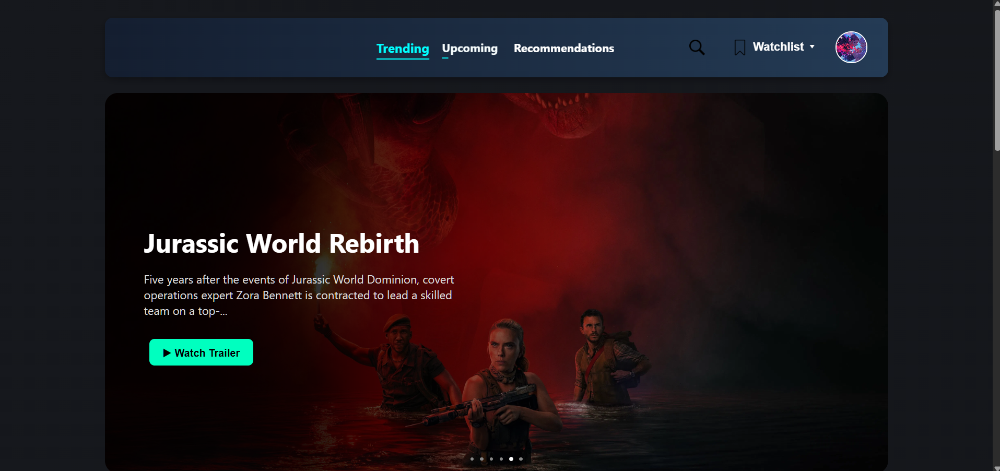
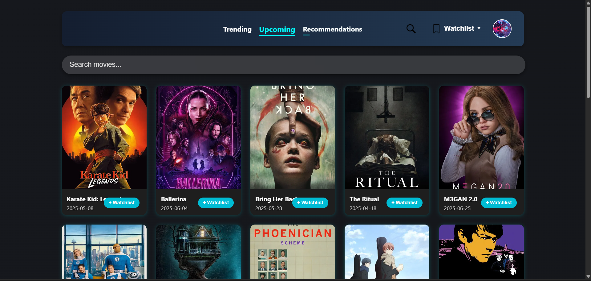
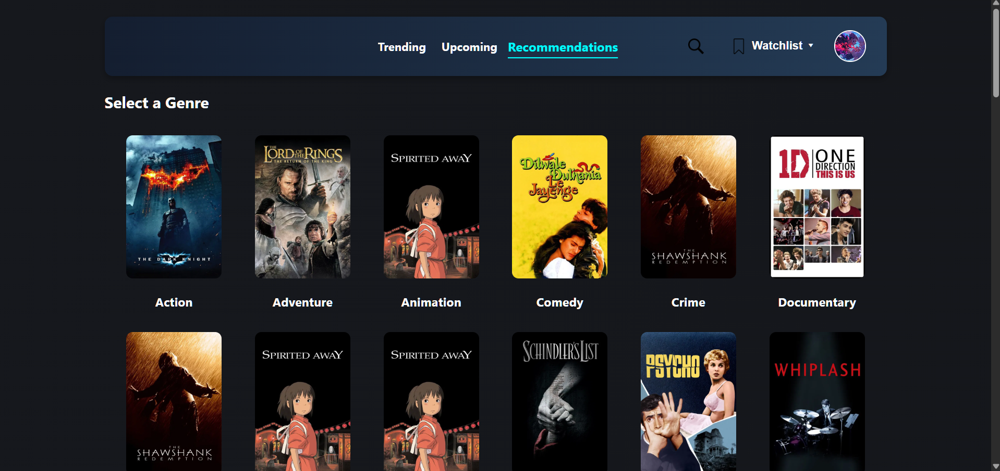

# 🎬 Gledati - Your Ultimate Movie Explorer

Welcome to **Gledati**, a full-stack web application built using the **TMDB API** that allows users to explore trending movies, upcoming releases, movies by genre and language, and even track what's new on OTT platforms.

## 🚀 Features

- 🔍 **Search** for movies by title
- 🔥 **Trending movies** of the day
- 📅 **Upcoming releases**
- 🎭 **Genre-based browsing**
- 🗣️ **Language-based movie discovery** with top-grossing cover
- 📺 **OTT availability detection**
- 🧾 **User subscription toggle** for weekly emails
- 🔐 **Admin dashboard** to manage movie digests

---

## 🧰 Tech Stack

### 🖥️ Frontend
- **React.js**
- **Axios** for API calls
- **React Router DOM** for navigation
- **TailwindCSS / CSS Modules** for styling

### 🔙 Backend
- **Node.js + Express**
- **MongoDB** (Mongoose ODM)
- **TMDB API** for movie data
- **Nodemailer** for email functionality
- **node-cron** for weekly scheduling
- **JWT Authentication**

## 👥 User Features

- **Search** and explore movies easily
- **View by genres and languages**
- **Subscribe/Unsubscribe** from weekly movie email digests
- **Responsive Design** — works on mobile, tablet, and desktop

---

## 🛡️ Admin Features

- **Send Weekly Digest** on demand
- View/manage user subscriptions (coming soon)
- JWT-protected admin routes

---

## 🖼️ Screenshots

| Home | Upcoming | Genre |
|------|----------|-------|
|  |  |  |

---

## 🧪 Local Setup Guide

### 🔗 Prerequisites
- Node.js (v18+)
- MongoDB (local or Atlas)
- TMDB API Key
- Gmail credentials (or another SMTP provider)

---

### 📥 Clone and Run

### 1. Clone the repo
- git clone https://github.com/User-156234/tmdb-movie-recommendation-app.git
- cd tmdb-movie-recommendation-app

### 2. Install backend dependencies - [Click Here](https://github.com/User-156234/tmdb-backend/) for Backend
cd backend

### 3. Create a .env file in /backend and add:
- TMDB_API_KEY=your_tmdb_key
- EMAIL_USER=your_email@gmail.com
- EMAIL_PASSWORD=your_app_password
- JWT_SECRET=your_jwt_secret
- MONGODB_URI=your_mongodb_uri

### 4. Start the backend
node server.js

### 5. In a new terminal, setup the frontend
- cd ../frontend
- npm install
- npm start
